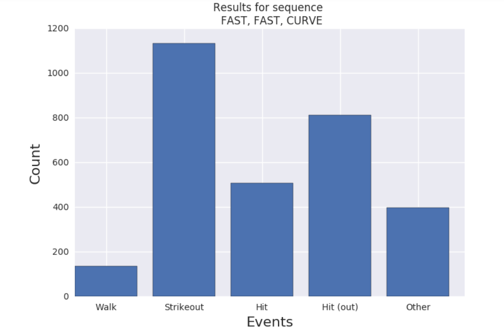
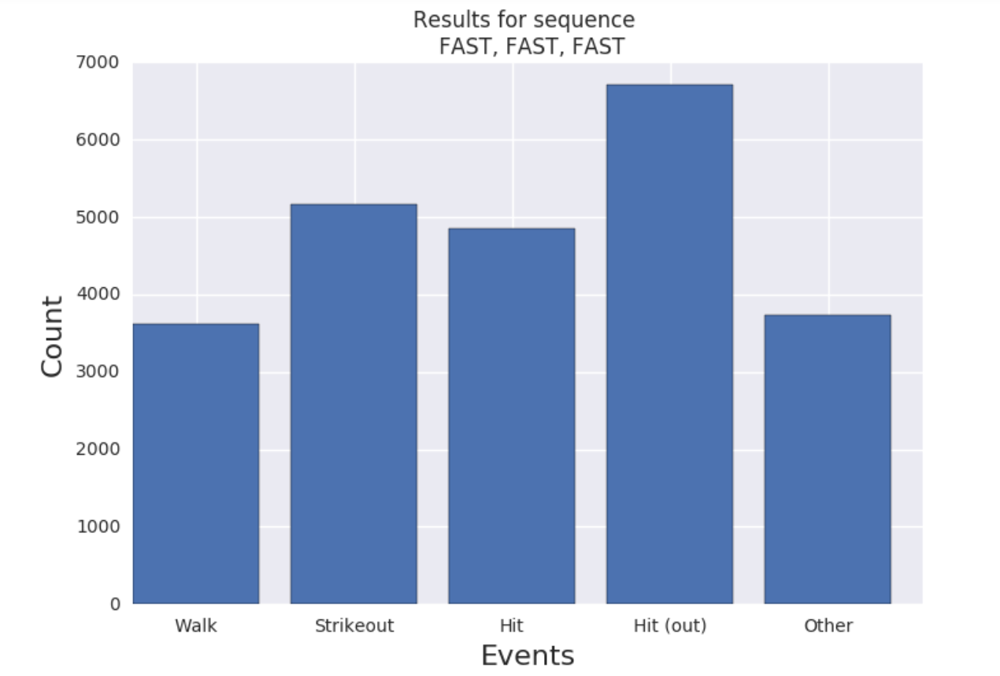
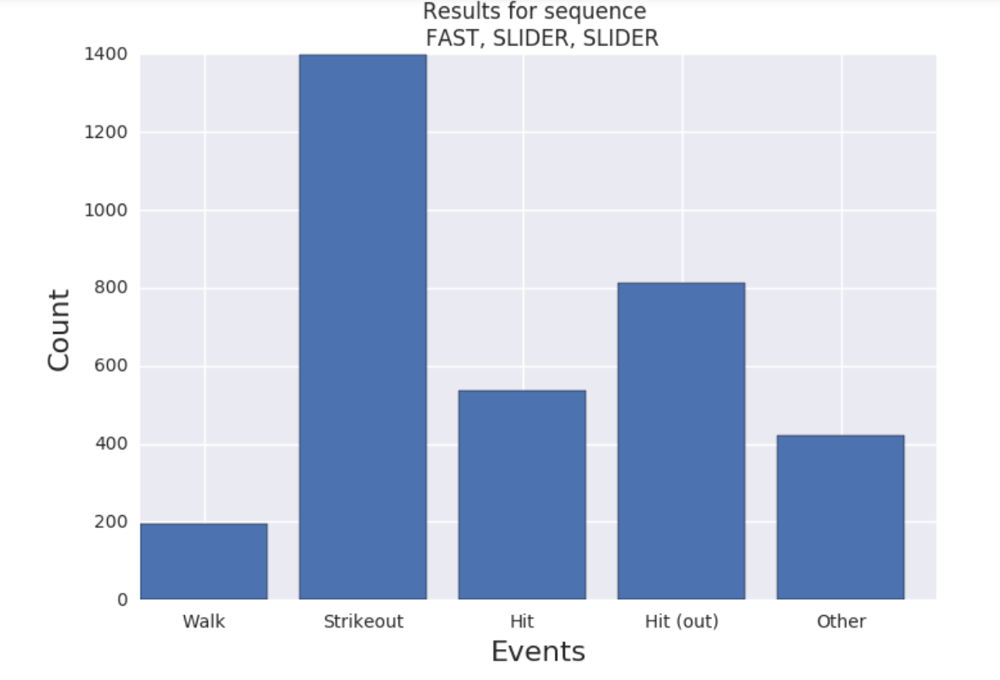
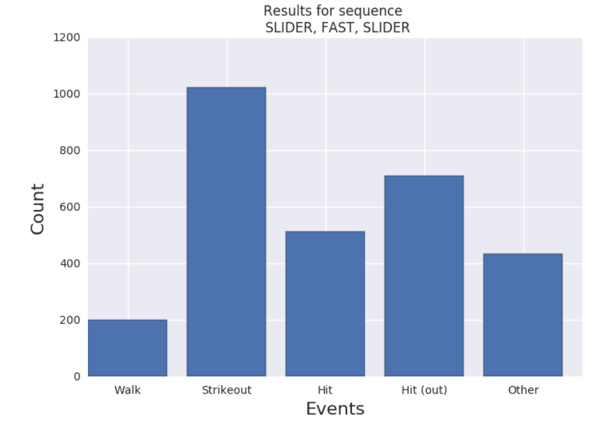

# pitchFX

## Dependencies(Imports):
* python3(or higher)
* import os
* import xml.etree.ElementTree as ET
* from time import sleep
* import numpy as np
* import matplotlib.pyplot as plt
* import seaborn as sns

## Whlie running the script in your system:

* Before running change the path of folder where you havae stored the MLB files in "combine_functions()" of Neuro.py file
* The imput sequences is case and space sensitive
* For case1 enter FAST FAST CURVE
* For case1 enter FAST FAST FAST
* For case1 enter FAST SLIDER SLIDER
* For case1 enter SLIDER FAST SLIDER

## Images of events caused by the last 3 pitches (if faced more than 3) faced by batsman at bat:

1. Fastball Fastball Curveball

2. Fastball Fastball Fastball

3. Fastball Slider Slider

4. Slider Fastball Slider

